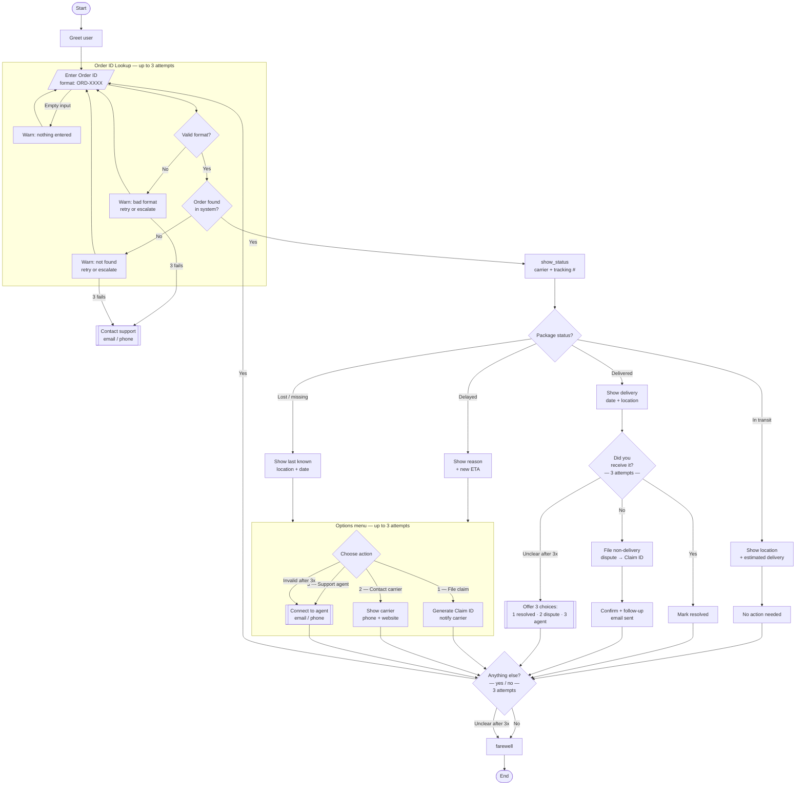

# TrackBot - Package Tracking Chatbot

A sophisticated CLI chatbot for customer service package tracking.

## Overview

TrackBot is an command-line interface chatbot designed to help customers track lost packages, check delivery status, and file claims with carriers. The application demonstrates advanced conversation flow design, robust error handling, and professional user experience patterns.

### Key Features

- Package lookup with order ID validation
- Multi-status support for in-transit, delivered, delayed, and lost packages
- Intelligent error recovery with 3-attempt retry system
- Natural language processing for user responses
- Professional CLI interface with clear navigation
- Carrier integration with direct contact information
- Automated claim management with reference number generation

## Installation & Setup

### Prerequisites

- Python 3.7 or higher
- Terminal or Command Prompt

### Quick Start

1. Clone the repository:

   ```bash
   git clone https://github.com/yourusername/trackbot-chatbot.git
   cd trackbot-chatbot
   ```

2. Run the chatbot:

   ```bash
   python src/trackbot.py
   ```

3. Test with sample data:
   - `ORD-1001` - In transit package
   - `ORD-2002` - Delivered package
   - `ORD-3003` - Delayed package
   - `ORD-4004` - Lost package

## Project Structure

```
trackbot-chatbot/
├── src/
│   └── trackbot.py          # Main application
├── docs/
│   ├── conversation-flow.md  # Detailed flow documentation
│   └── presentation.pdf     # Project presentation
├── assets/
│   ├── demo-screenshot.png  # UI screenshots
│   └── flowchart.png       # Visual conversation flow
├── tests/
│   └── test_trackbot.py    # Unit tests
├── README.md               # Documentation
├── requirements.txt        # Dependencies
└── .gitignore             # Git ignore rules
```

## Architecture

### Core Components

- **Mock Database**: Simulates real package tracking data with realistic scenarios
- **Validation Engine**: Regex-based input validation with format checking
- **Error Handler**: Natural language understanding for user responses
- **UI System**: Professional CLI interface with typing effects and formatting
- **Flow Controller**: State machine managing conversation paths and user journeys

### Conversation Flow

The chatbot follows a structured decision tree optimized for user experience:

```
Start → Greeting → Order ID Input → Package Lookup → Status Handler → Follow-up → End
```

Each stage includes comprehensive error handling and retry mechanisms to ensure smooth user interactions.



## Error Handling Examples

The application includes multiple sophisticated error handling patterns:

### 1. Invalid Order ID Format

Validates input against required pattern (ORD-XXXX) with clear feedback and retry options.

### 2. Unclear User Responses

Processes various forms of yes/no responses with intelligent normalization and fallback menus.

### 3. Menu Selection Errors

Handles out-of-range inputs with guided correction and alternative options.

### 4. Empty Input Handling

Gracefully manages blank responses with helpful prompts and retry logic.

## Testing

Each test order demonstrates different conversation paths and bot responses:

### **ORD-1001** - In Transit Package

```
🤖  Here's what I found:
🤖    Carrier:         FedEx
🤖    Tracking #:      7489234823948
🤖    Status:          📦  In Transit
🤖    Last seen:       Chicago, IL
🤖    Est. delivery:   Tomorrow, Apr 21

🤖  Your package is on its way and should arrive
🤖  Tomorrow, Apr 21. No action needed right now!
```

### **ORD-2002** - Delivered Package with Dispute Flow

```
🤖  Here's what I found:
🤖    Carrier:         UPS
🤖    Tracking #:      1Z999AA10123456784
🤖    Status:          ✅  Delivered
🤖    Delivered on:    Apr 18, 2026
🤖    Delivered to:    Front door

🤖  Our records show this package was delivered on Apr 18, 2026.
🤖  Did you receive it? (yes / no)
You › no
🤖  I'm sorry to hear that. I'll file a non-delivery dispute for you.
🤖  Dispute filed! Your claim ID is: CLM-47392
🤖  Our team will investigate and follow up within 2 business days.
```

### **ORD-3003** - Delayed Package with Options Menu

```
🤖  Here's what I found:
🤖    Carrier:         USPS
🤖    Status:          ⏳  Delayed
🤖    Last seen:       Memphis, TN
🤖    Reason:          Weather delay
🤖    New est. date:   Apr 24, 2026

🤖  I'm sorry your package is delayed. Here's what you can do:
🤖    [1] File a claim with the carrier
🤖    [2] Contact the carrier directly
🤖    [3] Speak to a support agent
You › 2
🤖  You can reach USPS at: 1-800-275-8777 / usps.com
🤖  Have your tracking number ready: 9400111899223397910495
```

### **ORD-4004** - Lost Package with Claim Filing

```
🤖  Here's what I found:
🤖    Carrier:         DHL
🤖    Status:          ❓  Lost / Missing
🤖    Last seen:       Los Angeles, CA
🤖    Last update:     Apr 10, 2026

🤖  I'm sorry — your package appears to be missing. Here's what you can do:
🤖    [1] File a claim with the carrier
🤖    [2] Contact the carrier directly
🤖    [3] Speak to a support agent
You › 1
🤖  Claim filed successfully! Your claim ID is: CLM-85029
🤖  Carrier: DHL will be notified automatically.
🤖  You'll receive a confirmation email with next steps.
```

### Error Handling Example

```
🤖  Please enter your Order ID (format: ORD-XXXX):
  You › abc123
🤖  That doesn't look like a valid Order ID. It should look like
🤖  ORD-1234. You have 2 attempt(s) remaining.

🤖  Please enter your Order ID (format: ORD-XXXX):
  You › ORD-9999
🤖  I couldn't find Order ID 'ORD-9999' in our system.
🤖  Double-check the ID on your confirmation email. 1 attempt(s) left.
```

## Technical Implementation

### Design Decisions

- **CLI Interface**: Enables rapid development focus on conversation logic
- **Retry Patterns**: Three-attempt system balancing user patience with efficiency
- **Mock Data**: Realistic scenarios based on actual package tracking patterns
- **State Management**: Clean conversation flow without complex state machines

## Future Enhancements

- Integration with real carrier APIs for live package data
- Web-based interface for broader accessibility
- Database storage for persistent user sessions
- Multi-language support for international customers
- Advanced analytics for conversation optimization
